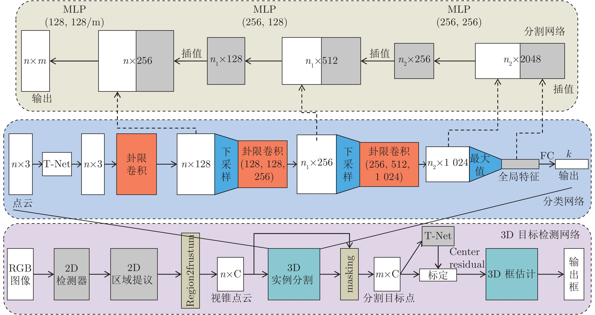

# 基于卦限卷积神经网络的3D点云分析
# Octant Convolutional Neural Network for 3D Point Cloud Analysis



## Introduction

该工作属于自动化学报的期刊论文．可以在<a href="http://www.aas.net.cn/article/doi/10.16383/j.aas.c200080">此</a>阅读．

This paper was accepted by ACTA AUTOMATICA SINICA and can be read <a href="http://www.aas.net.cn/article/doi/10.16383/j.aas.c200080">here</a>.

## Installation

Install <a href="https://tensorflow.google.cn/install">TensorFlow</a>. The code is tested under TF1.13 GPU version and Python 3.6 on Ubuntu 16.04. There are also some dependencies for a few Python libraries for data processing and visualizations like `cv2`, `h5py` etc.

### Compile Customized TF Operators

The TF operators are included under `tf_ops`, you need to compile them (check `tf_xxx_compile.sh` under each ops subfolder) first.

## Usage

### Shape Classification

To train a Octant-CNN model to classify ModelNet40 shapes:
```
python train.py
```

To see all optional arguments for training:
```
python train.py -h
```

After training, to evaluate the classification accuracies (with optional multi-angle voting):
```
python evaluate.py --num_votes 12
```

### Object Part Segmentation

To train a model to segment object parts for ShapeNet models, firstly download the data:
```
cd part_seg
sh download_data.sh
```

The downloading script will download <a href="http://web.stanford.edu/~ericyi/project_page/part_annotation/index.html" target="_blank">ShapeNetPart</a> dataset (around 1.06GB) and our prepared HDF5 files (around 346MB).

Then you can run `train.py` and `test.py` in the `part_seg` folder for training and testing (computing mIoU for evaluation).

### Semantic Segmentation of Indoor Scenes

To train a model to segment indoor scenes, firstly in the `sem_seg` folder:
```
cd sem_seg
```

#### Dataset

Download prepared HDF5 data for training:
```
sh download_data.sh
```

(optional) Download 3D indoor parsing dataset (<a href="http://buildingparser.stanford.edu/dataset.html">S3DIS</a>) for testing and visualization. Version 1.2 of the dataset is used in this work.

To prepare your own HDF5 data, you need to first download 3D indoor parsing dataset and then use `python collect_indoor3d_data.py` for data re-organization and `python gen-indoor3d_h5.py` to generate HDF5 files.

#### Training

Once you have downloaded prepared HDF5 files or prepared them by yourself, to start training:
```
python train.py --log_dir log5 --test_area 5
```

In default s simple model based on Octant-CNN is used for training. Area 5 is used for test set.

#### Testing

Testing requires download of 3D indoor parsing data and preprocessing with `collect_indoor3d_data.py`

After training, use `batch_inference.py` command to segment rooms in test set.
In our work we use 6-fold training that trains 6 models.
For model1, area2-6 are used as train set, area1 is used as test set. For model2, area1,3-6 are used as train set and area 2 is used as test set...

For example, to test model5, use command:
```
python batch_inference.py --model_path log5/model.ckpt --dump_dir log5/dump --output_filelist log5/output_filelist.txt --room_data_filelist meta/area5_data_label.txt --visu
```

Some OBJ files will be created for prediction visualization in `log5/dump`.

To evaluate overall segmentation accuracy, we evaluate 6 models on their corresponding test areas and use `eval_iou_accuracy.py` to produce point classification accuracy and IoU as reported in the paper.

### Object Detection

Will not be provided. If you want to use, please refer to <a href="https://github.com/charlesq34/frustum-pointnets">Frustum PointNets</a> for details.


## Reference Projects

* <a href="https://openaccess.thecvf.com/content_cvpr_2017/papers/Qi_PointNet_Deep_Learning_CVPR_2017_paper.pdf">PointNet: Deep Learning on Point Sets for 3D Classification and Segmentation</a> by Qi et al. (CVPR 2017 Oral Presentation). Code released in <a href="https://github.com/charlesq34/pointnet">Github</a>.

* <a href="https://arxiv.org/pdf/1706.02413.pdf">PointNet++: Deep Hierarchical Feature Learning on Point Sets in a Metric Space</a> by Qi et al. (NIPS 2017). Code released in <a href="https://github.com/charlesq34/pointnet2">Github</a>.

* <a href="https://arxiv.org/pdf/1807.00652.pdf">PointSIFT: A SIFT-like Network Module for 3D Point Cloud Semantic Segmentation</a> by Jiang et al. (arXiv) Code released in <a href="https://github.com/MVIG-SJTU/pointSIFT">Github</a>.

* <a href="https://openaccess.thecvf.com/content_cvpr_2018/papers/Qi_Frustum_PointNets_for_CVPR_2018_paper.pdf">Frustum PointNets for 3D Object Detection from RGB-D Data</a> by Qi et al. (CVPR 2018) Code released in <a href="https://github.com/charlesq34/frustum-pointnets">Github</a>.
